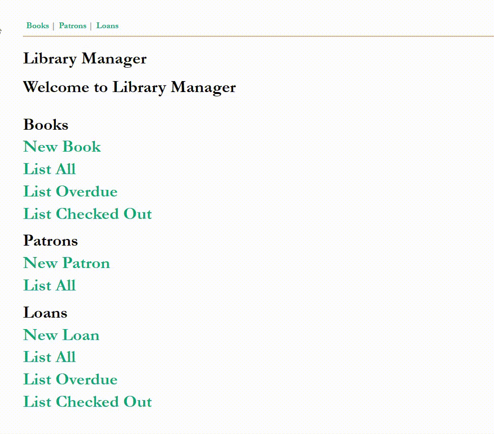
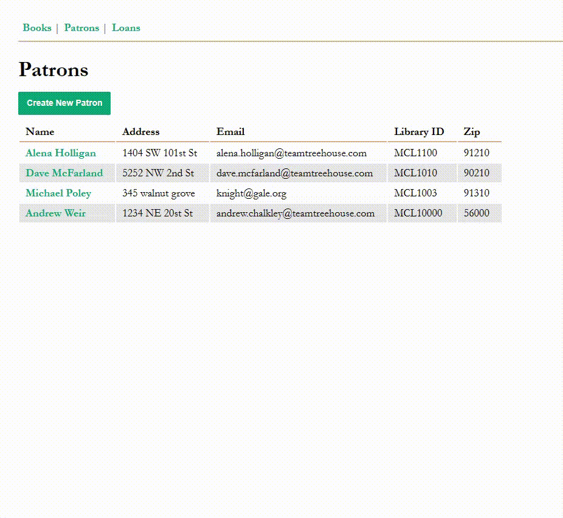
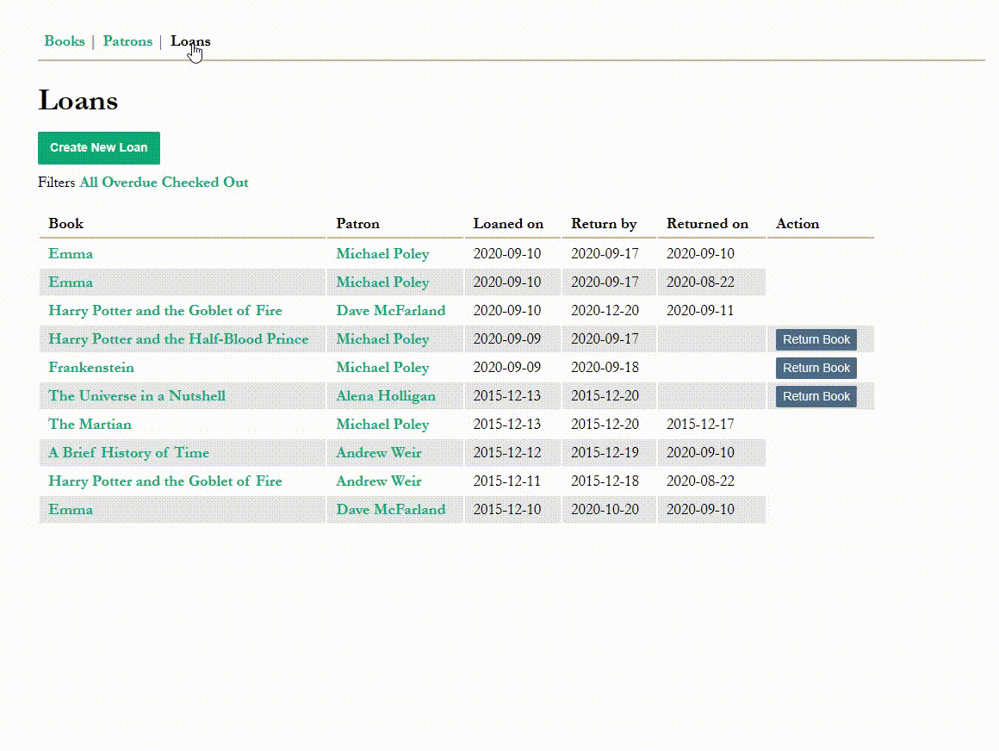

# Library Manager

This is a web application called Library Manager. It provides functionality for managing books, patrons, and loans in a library setting. The application has the following main sections:

## Books
- **New Book**: Add a new book to the library.
- **List All**: View a list of all books in the library.
- **List Overdue**: View a list of books that are currently overdue.
- **List Checked Out**: View a list of books that are currently checked out by patrons.

## Patrons
- **New Patron**: Add a new patron to the library.
- **List All**: View a list of all patrons in the library.

## Loans
- **New Loan**: Create a new loan record for a book borrowed by a patron.
- **List All**: View a list of all loan records in the library.
- **List Overdue**: View a list of loan records that are currently overdue.
- **List Checked Out**: View a list of loan records for books that are currently checked out.

The Library Manager application provides an easy-to-use interface for managing library resources and keeping track of book loans.
